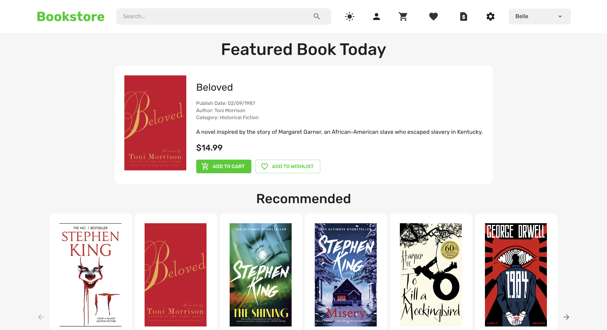
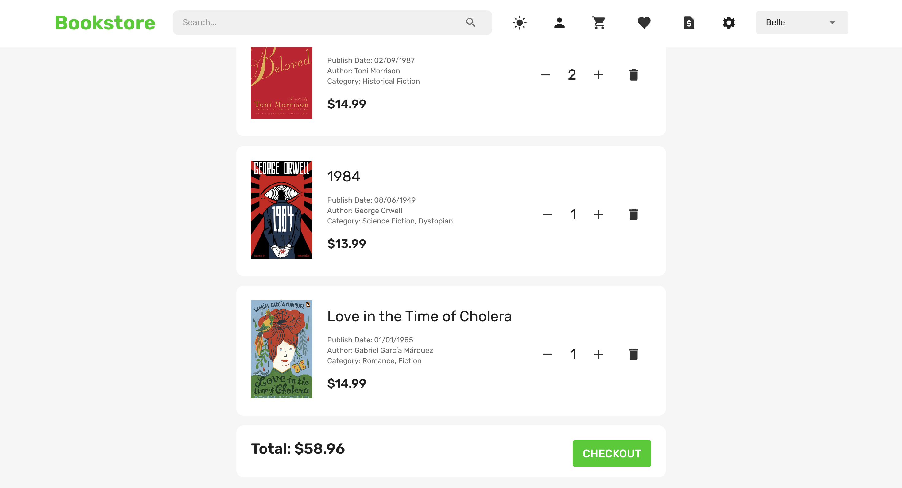
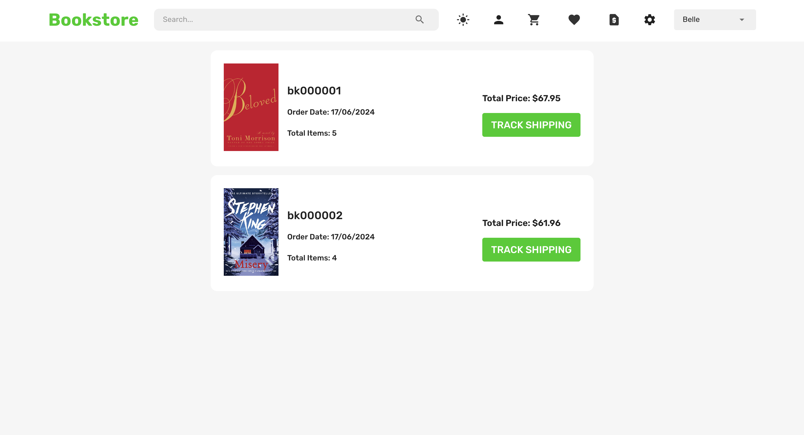
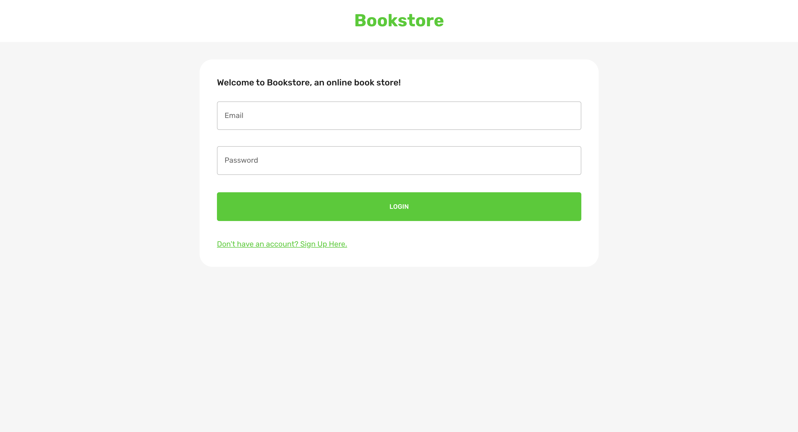
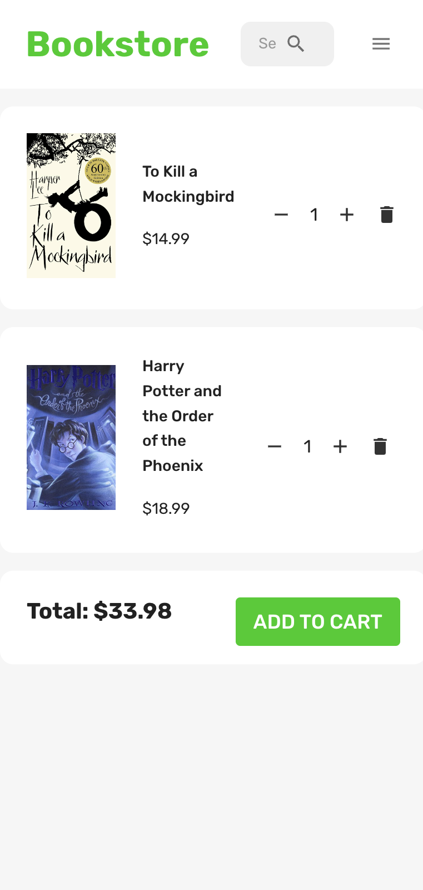

# Bookstore Client

This project is a frontend client for a bookstore application. It provides a user interface to browse books, manage orders, and interact with the bookstore server.

## Features

- **Browse Books**: View a list of available books.
- **Search**: Search for books by title or author.
- **User Authentication**: Register, login, and logout functionality.
- **Manage Cart and Wishlist**: Select books and add, remove and delete them from cart/wishlist.
- **Manage Orders**: View past orders and current shopping cart contents.

## Technologies Used

- **React**: JavaScript library for building user interfaces.
- **Redux**: State management for React applications.
- **React Router**: Declarative routing for React applications.
- **Axios**: HTTP client for making requests to the backend server.

## Screenshots









## Getting Started

### Prerequisites

- Node.js (version >= 12.0.0)
- npm or yarn package manager

### Installation

1. Clone the repository:

   ```bash
   git clone https://github.com/bellezhang119/bookstore-client.git